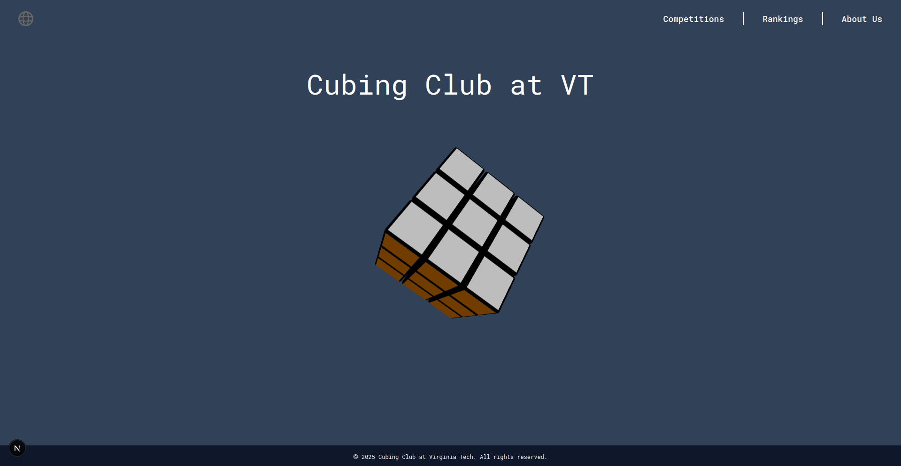

# Website for the Cubing Club at Virginia Tech 

## Getting Started

### Prerequisites

Ensure you have the following installed:

```
Python 3.x
Node.js 20.x 
```
### Installing

1. Clone the repository:
```
git clone https://github.com/Pojoto/cubingclub-vt.git
cd cubingclub-vt
```

2. Set up the [Backend](backend/README.md)
3. Set up the [Frontend](frontend/README.md)


## Run

1. Activate the virtual enviornment: 
    - Windows: `backend\.venv\Scripts\activate`
    - Linux: `source backend/.venv/bin/activate`
2. Run with node: `npm --prefix frontend run dev`
3. Open http://localhost:3000 

<!-- ## Built With -->
<!---->
<!-- * [Python](https://www.python.org/) - Programming language -->
<!-- * [pygame](https://www.pygame.org/) - Used for rendering of graphics -->

## Contributing

Contributions are welcome! If you find a bug, have a feature request, or would like to contribute code, feel free to open an issue or submit a pull request.
<!-- ## License -->
<!-- This project is licensed under the MIT License - see the [LICENSE.md](LICENSE.md) file for details. -->
